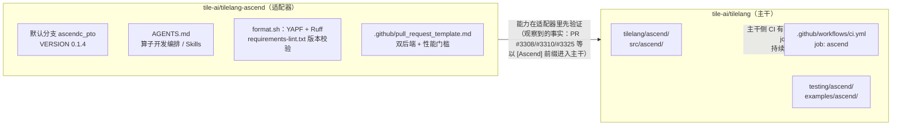

# 两棵树的协作（图 31-3）

```mermaid
flowchart LR
    subgraph A["tile-ai/tilelang（主干）"]
        A1["tilelang/ascend/<br/>src/ascend/"]
        A2[".github/workflows/ci.yml<br/>job: ascend"]
        A3["testing/ascend/<br/>examples/ascend/"]
    end
    subgraph B["tile-ai/tilelang-ascend（适配器）"]
        B1["默认分支 ascendc_pto<br/>VERSION 0.1.4"]
        B2["AGENTS.md<br/>算子开发编排 / Skills"]
        B3["format.sh：YAPF + Ruff<br/>requirements-lint.txt 版本校验"]
        B4[".github/pull_request_template.md<br/>双后端 + 性能门槛"]
    end
    B -->|"能力在适配器里先验证<br/>（观察到的事实：PR #3308/#3310/#3325 等<br/>以 [Ascend] 前缀进入主干）"| A
    A -->|"主干侧 CI 有独立 ascend job<br/>持续回归"| A2
```

**这张图要诚实读**：箭头方向是**从 corpus 快照与 PR 标题观察到的事实**，不是仓库里写死
的流程。两个仓库的 `CONTRIBUTING.md`、`AGENTS.md`、`.github/` 都没有写下「适配器先行、
再回主干」这条规定；正文第 7 节把它标为「无法确认（无成文依据）」。
