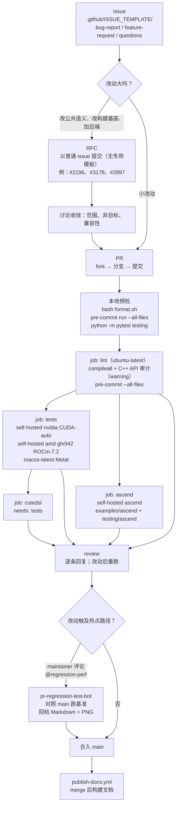

# 从 issue 到 CI（图 31-2）

```mermaid
flowchart TD
    I["issue<br/>.github/ISSUE_TEMPLATE/<br/>bug-report / feature-request / questions"] --> Q{改动大吗？}
    Q -->|"改公共语义、改构建基座、<br/>加后端"| R["RFC<br/>以普通 issue 提交（无专用模板）<br/>例：#2196、#3178、#2897"]
    Q -->|小改动| P
    R --> D[讨论收敛：范围、非目标、兼容性]
    D --> P["PR<br/>fork → 分支 → 提交"]
    P --> PC["本地预检<br/>bash format.sh<br/>pre-commit run --all-files<br/>python -m pytest testing"]
    PC --> CI1["job: lint（ubuntu-latest）<br/>compileall + C++ API 审计（warning）<br/>pre-commit --all-files"]
    CI1 --> CI2["job: tests<br/>self-hosted nvidia CUDA-auto<br/>self-hosted amd gfx942 ROCm-7.2<br/>macos-latest Metal"]
    CI1 --> CI3["job: ascend<br/>self-hosted ascend<br/>examples/ascend + testing/ascend"]
    CI2 --> CI4["job: cutedsl<br/>needs: tests"]
    CI1 --> REV["review<br/>逐条回复；改动后重跑"]
    CI2 --> REV
    CI3 --> REV
    CI4 --> REV
    REV --> PERF{"改动触及热点路径？"}
    PERF -->|"maintainer 评论<br/>@regression-perf"| PRB["pr-regression-test-bot<br/>对照 main 跑基准<br/>回帖 Markdown + PNG"]
    PERF -->|否| M[合入 main]
    PRB --> M
    M --> DOCS["publish-docs.yml<br/>merge 后构建文档"]
```

图里每个方框都对应仓库里的实际文件；「RFC 无专用模板」与「性能回归要 maintainer
触发」是两条容易踩空的规则，正文第 3、6 节展开。
